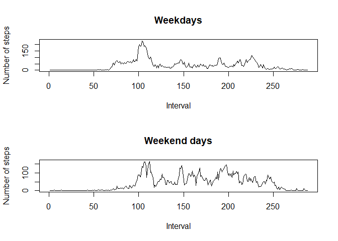

This report serves as a solution to Peer Assessment 1 of the course "Reproducible Research".


## Loading and preprocessing the data

Unzip the data (if it isn't unzipped already) and load it into R.


```r
if(!file.exists("activity.csv"))
{
    unzip("activity.zip")
}
activity <- read.csv("activity.csv")
```


## What is mean total number of steps taken per day?

First we calculate the total number of steps for each day.


```r
total.steps <- tapply(activity$steps, activity$date, sum)
```

This is a histogram of the total number of steps taken per day.


```r
hist(total.steps, breaks=10, xlab="Total number of steps", main="Histogram of total number of steps per day")
```

<!-- -->

The mean and median number of steps taken per day are given as follows (NA values are ignored).


```r
mean(total.steps, na.rm=TRUE)
```

```
## [1] 10766.19
```

```r
median(total.steps, na.rm=TRUE)
```

```
## [1] 10765
```


## What is the average daily activity pattern?

We will need the mean steps in each 5-minute interval, averaged across all days (NA values are ignored).


```r
interval.mean <- tapply(activity$steps, activity$interval, mean, na.rm=TRUE)
```

With this data we are able to plot a time series diagram with the steps in each 5-minute interval, averaged across all days.


```r
plot(interval.mean, type="l", xlab="Time (in 5-minute intervals)", ylab="Mean number of steps")
```

<!-- -->

The 5-minute interval (name and index in interval.mean) with the maximum mean numbers of steps per day can be calculated as follows.


```r
which.max(interval.mean)
```

```
## 835 
## 104
```

Thus the maximum mean number of steps among the 5-minute intervals is given by:


```r
interval.mean[which.max(interval.mean)]
```

```
##      835 
## 206.1698
```


## Imputing missing values

We calculate the total number of rows with missing values (for the steps taken).


```r
sum(is.na(activity$steps))
```

```
## [1] 2304
```

We will replace missing values in a given 5-minute interval by the mean number of steps for this 5-minute interval, given the days with no missing values (i.e. taking the values of interval.mean).


```r
activity.no.na <- activity

for(i in 1:length(activity.no.na$steps))
{
    if(is.na(activity.no.na$steps[i]))
    {
        # Which index of interval.mean corresponds to the 5-minute interval with the missing value.
        index <- which(names(interval.mean) == as.character(activity.no.na$interval[i]))
        
        # Replace the missing value in this 5-minute interval by the mean value of this 5-minute interval.
        activity.no.na$steps[i] <- interval.mean[index]
    }
}
```

With the missing data filled in, we can plot a new histogram of the total number of steps taken each day; for this, we first calculate the total number of steps again.


```r
total.steps.no.na <- tapply(activity.no.na$steps, activity.no.na$date, sum)

hist(total.steps.no.na, breaks=10, xlab="Total number of steps", main="Histogram of total number of steps per day (missing values replaced)")
```

<!-- -->

Again, we calculate the mean and median number of steps taken per day (NA values replaced).


```r
mean(total.steps.no.na)
```

```
## [1] 10766.19
```

```r
median(total.steps.no.na)
```

```
## [1] 10766.19
```

We remark that the "new" mean coincides with the "old" mean and the "new" median differs only slightly from the "old" median (with "new" corresponding to the data with NA values replaced, as opposed to the "old" data with NA values). This is no big surprise, since our values replacing the NA values are taken to be the respective mean values (and the mean and median values were already very close in the data set containing the NA values).


## Are there differences in activity patterns between weekdays and weekends?

First, we need to convert the date-column of activity.no.na into actual dates.


```r
activity.no.na$date <- as.Date(activity.no.na$date)
```

We introduce a new factor variable indicating whether a specific day is a weekday or weekend day.


```r
# Set the language to English (needed for weekdays to be displayed in English).
Sys.setlocale(category="LC_ALL", locale="english")
```

```
## [1] "LC_COLLATE=English_United States.1252;LC_CTYPE=English_United States.1252;LC_MONETARY=English_United States.1252;LC_NUMERIC=C;LC_TIME=English_United States.1252"
```

```r
# Create a logical vector with FALSE corresponding to weekdays and TRUE to weekend days
days.logical <- (weekdays(activity.no.na$date) == "Saturday") | (weekdays(activity.no.na$date) == "Sunday")

# Use this logical vector to create a vector with the factor variable.
days <- factor(c("weekday", "weekend")[days.logical+1])

# Add this factor variable as a new column to the data set.
activity.no.na$daytype <- days
```

Finally, we plot the time series of the activity data for weekdays and weekend days separately (using the base plotting system).


```r
par(mfcol=c(2,1))

data.weekday <- subset(activity.no.na, daytype=="weekday")
data.weekday <- tapply(data.weekday$steps, data.weekday$interval, mean)

data.weekend <- subset(activity.no.na, daytype=="weekend")
data.weekend <- tapply(data.weekend$steps, data.weekend$interval, mean)

plot(data.weekday, type="l", xlab="Interval", ylab="Number of steps", main="Weekdays")
plot(data.weekend, type="l", xlab="Interval", ylab="Number of steps", main="Weekend days")
```

<!-- -->
